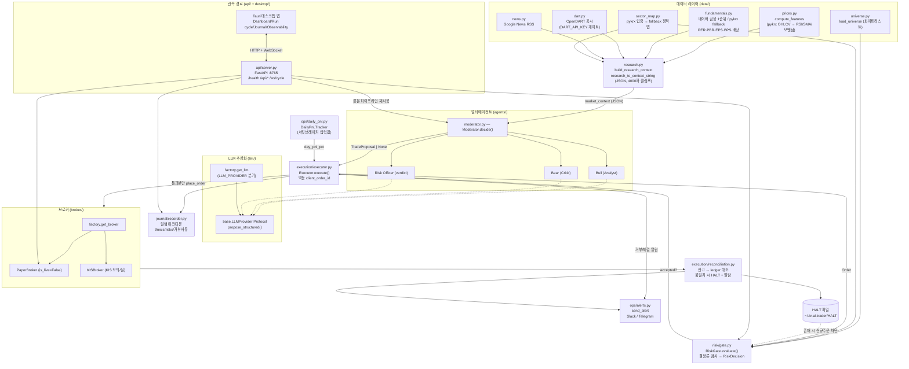
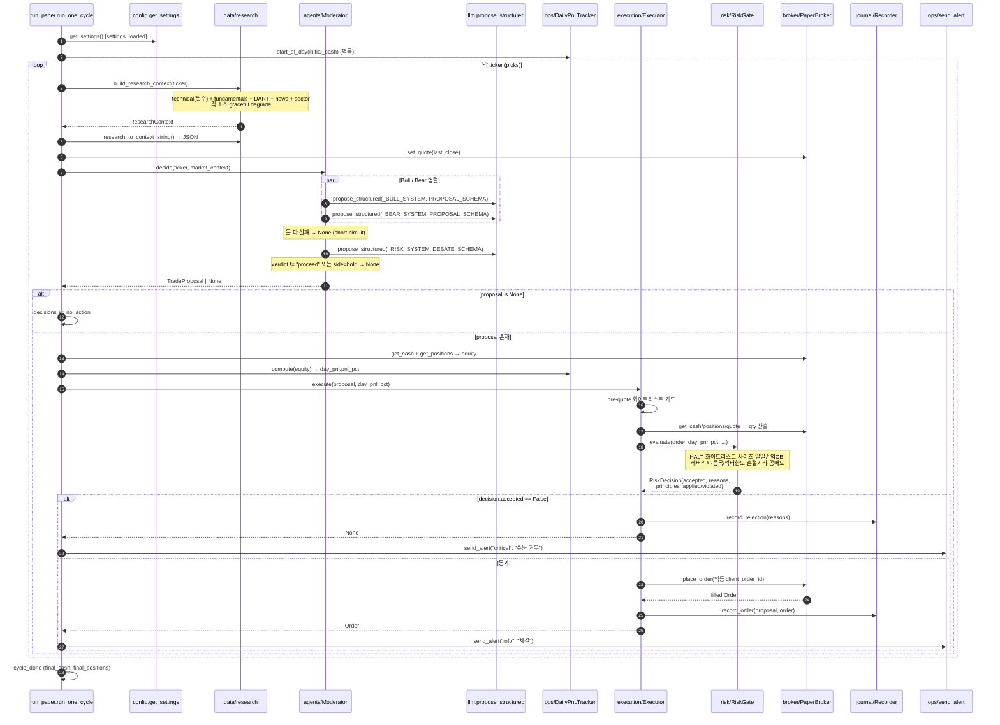

# 시스템 아키텍처 — kr-ai-trader

한국 리테일 투자자를 위한 LLM 기반 자동매매 봇의 시스템 설계 문서. 데이터 수집부터 멀티에이전트 합의, 결정론 리스크 게이트, 브로커 실행, 저널 기록, 그리고 FastAPI/Tauri 관측 경로까지 한 사이클 전체를 다룬다.

핵심 한 줄: **LLM 은 제안하고(propose), 결정론 코드가 처분한다(dispose).** LLM 출력은 절대 직접 주문이 되지 않으며, `risk/gate.py` 의 결정론 검사를 통과한 것만 브로커로 흐른다.

> 본 문서는 실제 코드(`src/kr_ai_trader/`)에 기반한다. 미구현·미검증 항목은 정직하게 caveat 로 표기했다.

---

## 1. 컴포넌트 다이어그램

데이터 → 리서치 → 멀티에이전트 → 리스크 게이트 → 브로커 → 저널의 핵심 파이프라인과, 이를 관측하는 FastAPI/Tauri 경로.



요점:

- 데이터 소스는 모두 `data/research.py` 의 `build_research_context()` 로 모이고 `research_to_context_string()` 가 4000자 클램프 아래의 단일 JSON 문자열로 압축한다(`_MAX_DISCLOSURES=5`, `_MAX_NEWS=6`).
- LLM 출력(`TradeProposal`)은 `Executor` 를 거쳐 반드시 `RiskGate.evaluate()` 를 통과해야 브로커로 간다.
- HALT 파일은 `reconciliation` 과 운영자가 떨어뜨리고, `RiskGate` 는 그 존재만으로 신규 주문을 차단한다.
- FastAPI(`api/server.py`)는 동일 파이프라인(`Moderator`/`RiskGate`/`PaperBroker`/`JournalRecorder`)을 재사용하되, `/ws/cycle` 은 세션마다 새 `PaperBroker` 를 생성해 `/api/positions` 의 전역 브로커와 의도적으로 분리한다.

---

## 2. 시퀀스 다이어그램 — 페이퍼 1 사이클

`scripts/run_paper.py` 의 `run_one_cycle()` 한 사이클을 종목 1건 기준으로 전개. 일일 PnL 서킷브레이커와 알람 경로를 포함한다.



서킷브레이커 흐름의 핵심: `DailyPnLTracker.start_of_day()` 가 KST 장 시작 자본을 `daily_pnl.json` 에 영속화하고, 매 제안마다 `compute(equity).pnl_pct` 가 `RiskGate.evaluate(day_pnl_pct=...)` 로 주입된다. 게이트에서 `day_pnl_pct <= -daily_loss_halt_pct` 이면 신규 매수 차단, `<= -daily_loss_flatten_pct` 이면 매수 전면 차단(청산만 허용). 거부 시 `send_alert("critical", ...)` 가 호출된다. 알람은 채널 미설정/실패 시 graceful degrade 하며 사이클을 멈추지 않는다(`run_paper._alert` 의 try/except).

> Caveat: FastAPI `/ws/cycle` 경로(`api/server.py`)는 현재 `day_pnl_pct=0.0` 으로 하드코딩해 호출한다(line 334). 즉 일일 손익 서킷브레이커는 `run_paper.py` 경로에서만 실제로 구동되고, UI 사이클에서는 아직 무력화 상태다.

---

## 3. 핵심 설계 원칙 — "LLM proposes, deterministic code disposes"

LLM 은 분석가이지 리스크매니저가 아니다. 제안과 처분의 경계가 코드로 강제된다.

| 단계 | 주체 | 코드 위치 | 성격 |
|---|---|---|---|
| 시장 해석·매매 *제안* | LLM (Bull/Bear/Risk Officer) | `agents/moderator.py` | 비결정론, 프롬프트 기반 |
| 스키마 검증 | 코드 | `llm/base.py` `validate_against_schema` (Draft202012) | 결정론 |
| 주문 *처분* | 코드 | `risk/gate.py` `RiskGate.evaluate` | 결정론, explainable |
| 체결 | 코드 | `broker/paper.py` · `broker/kis.py` | 결정론 |
| 기록 | 코드 | `journal/recorder.py` | 결정론 |

### RiskGate 결정론 검사 → 10대 계명 매핑

`risk/gate.py` 의 각 검사는 자매 리포 [cskwork/investment-agent-rules](https://github.com/cskwork/investment-agent-rules) 의 10대 계명 중 하나를 강제하고, `RiskDecision.principles_applied` / `principles_violated` 로 반환한다. 검사가 하나라도 `reasons` 를 채우면 `accepted=False`(line 188).

| 검사 (gate.py 라인) | 계명 | 동작 |
|---|---|---|
| HALT 파일 존재 (line 89) | 1 Capital Preservation, 10 Behavioral Discipline | 존재 시 모든 신규 주문 차단 |
| 화이트리스트 외 티커 (line 95) | 3 Circle of Competence | LLM 환각 종목 거부 |
| 사이즈 0/음수 (line 101) | 9 Process Over Outcome | 비양수 수량 거부 |
| 일일 손실 halt (line 109) | 1 Capital Preservation | `-daily_loss_halt_pct` 돌파 시 신규 매수 차단 |
| 일일 손실 flatten (line 115) | 1 Capital Preservation | `-daily_loss_flatten_pct` 돌파 시 매수 전면 차단(청산만) |
| 레버리지 0 (line 128) | 1 Capital Preservation | `leverage=0` 인데 notional > cash 면 거부 |
| 종목 비중 한도 (line 140) | 6 Position Sizing, 7 Concentration | `max_position_pct(3%)` 초과 거부 |
| 섹터 비중 한도 (line 160) | 7 Concentration | `max_sector_pct(30%)` 초과 거부 (sector_map 주입 시) |
| 손절 거리 (line 170) | 6 Position Sizing & Asymmetric R:R | `proposed_stop_loss_pct > hard_stop_pct` 거부 |
| 공매도 차단 (line 181) | 1 Capital Preservation | 보유 수량 < 매도 수량이면 거부 |

전체 계명별 enforced/partial/missing 상태(4 enforced / 5 partial / 1 missing)는 [docs/principles-mapping.md](./principles-mapping.md) 참고. LLM 측에서도 `agents/moderator.py` 의 Bull/Bear/Risk Officer 시스템 프롬프트(`_BULL_SYSTEM`/`_BEAR_SYSTEM`/`_RISK_SYSTEM`)에 10대 계명 전문(`_PRINCIPLES`)이 인용되어 thesis 에 적용 계명을 명시하도록 유도한다. 단, 이는 *유도*일 뿐 강제는 `RiskGate` 가 한다.

> 다층 방어: 화이트리스트 가드는 `Executor.execute` 의 pre-quote 단계(executor.py line 66)와 `RiskGate.evaluate`(gate.py line 95) 양쪽에 중복으로 존재한다 — broker quote 호출 전에 한 번, 게이트에서 다시 한 번.

---

## 4. 데이터 소스 — 인증·fallback

`build_research_context()` 가 종목 1건당 모으는 소스. 모든 소스는 자체 graceful degrade 하고, 리서치 레이어에서도 방어적으로 예외를 감싼다(가격 제외 — 가격 실패 시 호출자가 해당 종목 skip).

| 소스 | 모듈 | 인증 | 1순위 / fallback | 비고 (caveat) |
|---|---|---|---|---|
| 기술적 지표 (필수) | `data/prices.py` `compute_features` | 불필요 | pykrx OHLCV | RSI14/SMA/모멘텀. 실패 시 종목 skip |
| 펀더멘털 | `data/fundamentals.py` `get_fundamentals` | 불필요(네이버) | 네이버 금융 모바일 API 1순위 → pykrx `get_market_fundamental_by_date` fallback | pykrx 1.2.x+ 펀더멘털은 KRX 회원 로그인 필요 → 네이버를 primary 로 둠. 둘 다 실패 시 모든 필드 None |
| DART 공시 | `data/dart.py` `get_disclosures` | `DART_API_KEY` 필요 | OpenDART REST | 키 미설정 시 자동 off(빈 리스트). 키 없이는 미검증 |
| 뉴스 | `data/news.py` `get_news` | 불필요 | Google News RSS, 종목명 기반 | `enable_news` + 종목명 있을 때만. 종목당 `news_lookback_items` 건 |
| 섹터 | `data/sector_map.py` `build_sector_map` | 불필요 | 캐시 → pykrx 업종지수 열거 → fallback 정적맵(10종목) | live fetch 실패/누락 시 `_FALLBACK_SECTOR_MAP` 정적 매핑으로 폴백 |
| 유니버스 | `data/universe.py` `load_universe` | 불필요 | KOSPI200 등 화이트리스트 | RiskGate Circle of Competence 강제용 |

소스별 토글·파라미터(`config.py`): `enable_dart` / `dart_api_key` / `dart_lookback_days`, `enable_news` / `news_lookback_items`. DART 는 `enable_dart and dart_api_key is not None` 일 때만 호출된다(research.py line 77).

알려진 live-data caveat (정직하게):

- **섹터 live fetch 는 검증이 약하다** — `_fetch_full_sector_map` 이 빈 dict 를 반환하면 10종목 `_FALLBACK_SECTOR_MAP` 으로 폴백한다. fallback 에 없는 종목은 섹터 한도 검사에서 누락된다.
- **DART 는 키 없이 미검증** — `DART_API_KEY` 미설정 환경에서는 공시 수집 자체가 비활성이라 실경로가 테스트되지 않았다.
- **pykrx 펀더멘털은 KRX 로그인 요구** — 그래서 네이버가 primary. 네이버 표기(`'28.21배'`, `'12,372원'`)는 `_parse_naver_num` 정규식으로 파싱한다.

---

## 5. 멀티 LLM 백엔드 추상화

5종 백엔드를 동일 시그니처로 사용. 모든 매매 신호는 `propose_structured()` 한 메서드로 흐른다.

### Protocol (`llm/base.py`)

```python
@runtime_checkable
class LLMProvider(Protocol):
    name: str
    model: str
    async def propose_structured(self, *, system, user, schema,
                                 max_tokens=2048, temperature=0.2) -> LLMResponse: ...
    async def healthcheck(self) -> bool: ...
```

- `LLMResponse` 는 `raw_text`, `data`(스키마 통과 dict), `model`, `provider`, `usage` 를 담는 frozen dataclass.
- `validate_against_schema` 는 `jsonschema` 가 있으면 `Draft202012Validator` 로 enum/min/max/additionalProperties 까지 엄격 검증, 없으면 required+type 경량 fallback.
- `extract_json` 은 모델 응답에서 마지막 ```json``` fenced block 또는 마지막 균형 잡힌 `{…}` 객체를 추출 — 본문에 예시 JSON 이 섞여도 최종 답변만 선택.

### Factory (`llm/factory.py`)

`get_llm(settings)` 가 `settings.llm_provider`(`LLMProviderName` enum) 한 줄로 분기. 각 provider 는 지연 import.

| Provider | 인증 | 모델 기본값 |
|---|---|---|
| `anthropic_api` | `ANTHROPIC_API_KEY` | `claude-sonnet-4-6` (tool_use structured output) |
| `openai_api` | `OPENAI_API_KEY` | `gpt-5` (`response_format=json_schema`) |
| `claude_code_cli` | **불필요** (기본값) | `haiku` (`claude -p --json-schema`) |
| `codex_cli` | **불필요** | `gpt-5` (로그인 세션 활용) |
| `ollama` | 로컬 | `qwen2.5:14b-instruct` (`localhost:11434`) |

기본 provider 는 `claude_code_cli`(`config.py` line 34) — API 키 0원 경로.

`Moderator` 는 이 추상화 위에서 Bull/Bear 를 `asyncio.gather` 로 병렬 호출(`PROPOSAL_SCHEMA`)하고, 두 의견을 Risk Officer 에게 넘겨 `DEBATE_SCHEMA` 로 합의(`verdict ∈ {proceed, reject}`)를 받는다. `verdict != "proceed"` 또는 `side == "hold"` 이면 `None`(무포지션이 디폴트).

---

## 6. 안전 모델

### 페이퍼 디폴트 + KIS_LIVE 게이팅

- 기본 브로커는 `PaperBroker`(`is_live=False`). `broker/factory.get_broker` 는 KIS 자격증명(`kis_app_key`/`kis_app_secret`/`kis_account_number`)이 모두 있어야 `KISBroker` 를 만들고, `force_paper=True` 면 항상 페이퍼.
- `KISBroker` 는 `is_live=False` 일 때 `virtual=True`(모의투자 도메인)로 KIS 에 접속한다(`kis.py` line 45).
- **실계좌는 이중 게이트**: `config.py` `_validate_thresholds` 가 `kis_live=True` 인데 `kis_live_confirm != "I_UNDERSTAND_REAL_MONEY"` 이면 시작을 거부하고 `ValueError` 를 던진다(line 106). 즉 `KIS_LIVE=1` 만으로는 실거래가 켜지지 않고 `KIS_LIVE_CONFIRM` 명시가 추가로 필요하다.

### HALT 파일 kill switch

- 경로: `settings.halt_file`(기본 `~/.kr-ai-trader/HALT`).
- `RiskGate.evaluate` 가 파일 존재만으로 모든 신규 주문을 차단(gate.py line 89, 계명 1·10).
- `reconciliation.reconcile_and_guard` 가 drift 감지 시 이 파일을 touch 하고 알람을 보낸다. 알람 실패가 HALT 를 막지 않도록 try/except 로 격리(line 135).

### Reconciliation (잔고 ↔ ledger 대조)

- `execution/reconciliation.py` 가 내부 장부(expected) 와 브로커 보고(actual) 를 대조해 `missing`/`extra`/`qty_mismatch` 로 분류.
- 불일치 시: 알람 + HALT 파일 생성 → 다음 사이클부터 RiskGate 가 차단.
- 브로커 *조회 실패* 만으로는 HALT 를 걸지 않는다(`ok=True` 빈 결과 반환) — 일시 장애 과반응 방지(line 91).

### 멱등 주문 + 거래비용

- `Executor.make_idempotent_id` 가 `(strategy, ticker, KST 거래일, side, qty_bucket)` SHA1 로 결정론적 `client_order_id` 생성 — uuid/wall-clock 미포함. 동일 키 재전송 시 `PaperBroker._orders` dedup(paper.py line 78)으로 중복 체결 방지.
- 거래비용은 `Settings` 로 외부화: 매수/매도 `commission_pct`, 매도 거래세 `tax_kospi_sell_pct`/`tax_kosdaq_sell_pct`(KRX 거래세는 시기·시장별로 변하므로).

### 저널 안전성

- `journal/recorder.py` 는 인스턴스별 `asyncio.Lock` + 원자적 헤더 생성(`open("x")`)으로 동시 쓰기 안전.
- LLM 자유 텍스트(thesis/risks/reasons)는 `_escape_md` 로 트리플 백틱을 무력화 — 마크다운 인젝션 방지.

### API 경계 검증

- `api/server.py` 는 티커를 6자리 숫자 정규식(`_TICKER_RE`)으로 강제(path traversal / pykrx rate-limit 남용 차단), cash 를 `[1천원, 100억원]` 범위로 clamp.
- CORS 는 Tauri dev origin + `tauri://localhost` 만 허용, credentials 비활성.

---

## 부록 — 관련 파일

- 파이프라인 진입점: `scripts/run_paper.py` (`run_one_cycle`)
- 설정: `src/kr_ai_trader/config.py` (`Settings`, `_validate_thresholds`)
- 리서치 집계: `src/kr_ai_trader/data/research.py`
- 에이전트: `src/kr_ai_trader/agents/moderator.py`, `agents/schemas.py`
- 리스크 게이트: `src/kr_ai_trader/risk/gate.py`
- 실행: `src/kr_ai_trader/execution/executor.py`, `execution/reconciliation.py`
- 브로커: `src/kr_ai_trader/broker/{base,paper,kis,factory}.py`
- 저널: `src/kr_ai_trader/journal/recorder.py`
- 운영: `src/kr_ai_trader/ops/{daily_pnl,alerts}.py`
- LLM: `src/kr_ai_trader/llm/{base,factory}.py`
- API: `src/kr_ai_trader/api/server.py`
- 계명 매핑: `docs/principles-mapping.md`
</content>
</invoke>
