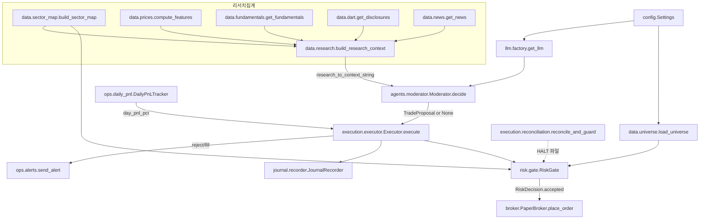

# 코드베이스 레퍼런스 (Codebase Map)

`kr-ai-trader` 의 모듈별 개발자 지도. 패키지 단위로 **목적 → 주요 공개 API(시그니처) → 협력 모듈 → 커버 테스트** 를 정리한다. 실제 코드를 읽고 작성했으며, 인용한 파일 경로/함수명/설정 필드는 모두 `src/kr_ai_trader/` 안의 실물과 일치한다.

> 투자 의사결정 원칙(10대 계명)과 안전 기본값은 [README.md](../README.md) 를, 계명-코드 매핑은 [docs/principles-mapping.md](./principles-mapping.md) 를 참고.

---

## 어디서 시작할까 (신규 기여자 오리엔테이션)

1. **`config.py` 먼저 읽어라.** `Settings`(Pydantic) 가 LLM/브로커/리스크/리서치/알람 토글을 전부 들고 있다. 어떤 동작이 왜 그렇게 도는지의 단일 진실원천.
2. **한 사이클의 실물은 `scripts/run_paper.py` 의 `run_one_cycle()`.** 이 함수가 데이터→에이전트→리스크→브로커→저널을 직선으로 엮는다. 전체 흐름을 한 화면에서 본다.
3. **데스크톱 UI 와 같은 흐름의 스트리밍 버전은 `api/server.py` 의 `ws_cycle()`.** 단계별 WebSocket 이벤트(`features_computed → moderator_started → proposal_built → risk_gate_decision → order_placed`)로 같은 파이프라인을 중계한다.
4. **"코드가 리스크매니저"의 핵심은 `risk/gate.py` 의 `RiskGate.evaluate()`.** LLM 이 무엇을 제안하든 결정론 게이트가 최종 결정한다. 테스트(`test_risk_gate.py`)부터 읽으면 의도가 빠르게 잡힌다.
5. 데이터 소스(`data/`) 는 전부 **graceful degrade** — 죽은 외부 소스가 사이클을 멈추지 않는다. 이 규약을 깨지 않도록 주의.

추천 진입 테스트: `tests/test_executor_integration.py`(전체 흐름), `tests/test_risk_gate.py`(게이트 규칙), `tests/test_regression.py`(과거 버그 회귀).

---

## 디렉토리 트리

```text
src/kr_ai_trader/
  __init__.py
  config.py                 # Pydantic Settings (싱글톤 get_settings/reset_settings)
  cli.py                    # typer CLI: info / ping-llm
  llm/                      # 5종 LLM provider 추상화 (Protocol + factory)
    base.py                 # LLMProvider Protocol, LLMResponse, extract_json, schema 검증
    factory.py              # get_llm(): LLM_PROVIDER → 구현체
    anthropic_api.py        # Claude API (tool_use)
    openai_api.py           # OpenAI API (response_format json_schema)
    claude_code_cli.py      # claude --print --json-schema (API 키 불필요)
    codex_cli.py            # codex exec --json (API 키 불필요)
    ollama.py               # 로컬 Ollama /api/chat
  broker/                   # Broker Protocol + 구현
    base.py                 # Broker Protocol, Order/Position/Quote/OrderSide
    paper.py                # PaperBroker (인메모리, 거래비용 모델)
    kis.py                  # KISBroker (python-kis/pykis 래퍼)
    factory.py              # get_broker(): 자격증명 있으면 KIS, 없으면 Paper
  agents/                   # 멀티에이전트 토론
    schemas.py              # PROPOSAL_SCHEMA / DEBATE_SCHEMA (JSON Schema)
    moderator.py            # Bull+Bear+RiskOfficer → Moderator.decide() → TradeProposal
  risk/
    gate.py                 # RiskGate.evaluate() → RiskDecision (결정론 게이트)
  execution/
    executor.py             # Executor.execute(): 제안→게이트→주문→저널, 멱등 ID
    reconciliation.py       # reconcile_and_guard(): 잔고↔ledger 대조 + HALT
  data/                     # 시세/유니버스/리서치 (전부 graceful degrade)
    prices.py               # pykrx OHLCV, compute_features (RSI/SMA/모멘텀)
    universe.py             # 티커 화이트리스트 로드
    calendar.py             # KRX 거래 캘린더/영업일
    fundamentals.py         # 네이버 우선 PER/PBR/EPS, pykrx fallback
    dart.py                 # OpenDART 공시 (DART_API_KEY 필요)
    news.py                 # Google News RSS 헤드라인
    sector_map.py           # ticker→섹터 (pykrx, 실패 시 정적 fallback)
    research.py             # build_research_context: 위 소스 집계 → JSON 문자열
  ops/                      # 운영 안전장치
    alerts.py               # send_alert(): Slack/Telegram
    daily_pnl.py            # DailyPnLTracker: 서킷브레이커 입력값(day_pnl_pct)
  journal/
    recorder.py             # JournalRecorder: journal/YYYY-MM-DD.md 마크다운
  backtest/
    runner.py               # vectorbt 래퍼 run_backtest()
  api/
    server.py               # FastAPI: REST + /ws/cycle (데스크톱 UI 백엔드)
scripts/                    # 실행 진입점 (run_paper / smoke_llm / demo_buy_then_sell)
tests/                      # pytest (네트워크/pykrx 전부 monkeypatch)
```

---

## 한 사이클의 데이터 흐름 (module-to-module)

`scripts/run_paper.py::run_one_cycle` 기준으로 모듈을 잇는다.

1. **설정 로드** — `config.get_settings()` 가 `Settings` 싱글톤 반환.
2. **유니버스** — `data/universe.load_universe(settings.universe, settings.universe_file)` 가 화이트리스트 `frozenset[str]` 반환. pykrx 인덱스 실패 시 fallback 10종목.
3. **LLM/브로커/게이트 조립** — `llm/factory.get_llm()`, `broker.PaperBroker`, `data/sector_map.build_sector_map(universe)`, `risk.gate.RiskGate(settings, universe, sector_map)`, `journal.JournalRecorder`, `ops/daily_pnl.DailyPnLTracker(settings.daily_pnl_file)`, `execution.Executor`, `agents.Moderator(llm)`.
4. **장 시작 자본 기록** — `pnl_tracker.start_of_day(initial_cash)` (멱등, KST 날짜 기준).
5. **종목별 리서치** — `data/research.build_research_context(ticker, settings=settings)` 가 `compute_features`(prices) + `get_fundamentals`(네이버) + `get_disclosures`(DART, 키 있을 때) + `get_news`(Google) + `build_sector_map` 를 한 `ResearchContext` 로 묶는다.
6. **가격 주입** — `broker.set_quote(Quote(...))` 로 페이퍼 브로커에 현재가 세팅.
7. **컨텍스트 직렬화** — `research_to_context_string(research)` → 4000자 클램프 JSON 문자열.
8. **멀티에이전트 토론** — `Moderator.decide(ticker, market_context)` 가 Bull/Bear 를 `asyncio.gather` 로 병렬 호출(`PROPOSAL_SCHEMA`) 후 RiskOfficer 가 합의(`DEBATE_SCHEMA`). `verdict != proceed` 또는 `side in (None, hold)` 면 `None`(no_action).
9. **서킷브레이커 입력** — 현재 equity 로 `pnl_tracker.compute(equity).pnl_pct` 계산.
10. **실행** — `Executor.execute(proposal, day_pnl_pct=...)`:
    - universe 사전 가드(quote 호출 전) → `RiskGate.evaluate(...)` → 통과 시 `broker.place_order(order)`.
    - 거부/체결 모두 `JournalRecorder.record_rejection` / `record_order` 로 `journal/YYYY-MM-DD.md` 에 기록.
11. **알람** — 거부 시 `ops/alerts.send_alert("critical", ...)`, 체결 시 `"info"`. 채널 미설정/실패 시 graceful.



---

## 패키지별 레퍼런스

### `config.py` — 환경변수 기반 설정

- **목적**: `.env` 자동 로드 Pydantic `Settings`. 전체 시스템의 단일 설정 원천.
- **주요 API**
  - `class LLMProviderName(str, Enum)`: `anthropic_api / openai_api / claude_code_cli / codex_cli / ollama`.
  - `class Settings(BaseSettings)`: 주요 필드 — `llm_provider`(기본 `claude_code_cli`), `anthropic_model="claude-sonnet-4-6"`, `claude_code_model="haiku"`, `kis_live: bool=False`, `kis_live_confirm`, 리스크(`max_position_pct=3.0`, `max_sector_pct=30.0`, `daily_loss_halt_pct=2.0`, `daily_loss_flatten_pct=4.0`, `hard_stop_pct=7.0`, `leverage=0.0`), 거래비용(`commission_pct=0.00015`, `tax_kospi_sell_pct=0.0018`, `tax_kosdaq_sell_pct=0.0018`), 리서치(`dart_api_key`, `dart_lookback_days=14`, `enable_dart`, `news_lookback_items=8`, `enable_news`), 알람(`slack_webhook_url`, `telegram_bot_token`, `telegram_chat_id`), 운영(`halt_file`, `reconciliation_interval_sec=60`, `daily_pnl_file`).
  - `@model_validator _validate_thresholds`: `daily_loss_halt_pct <= daily_loss_flatten_pct` 강제, `kis_live=True` 시 `kis_live_confirm='I_UNDERSTAND_REAL_MONEY'` 없으면 실행 거부.
  - `get_settings() -> Settings` (싱글톤), `reset_settings() -> None` (테스트용).
- **협력자**: 모든 factory/모듈이 `Settings` 를 주입받음.
- **테스트**: 직접 단위 테스트 파일 없음. `tests/conftest.py` 가 `reset_settings()` 등으로 픽스처 구성하며 거의 모든 테스트가 `Settings()` 를 직접 인스턴스화해 사용.

### `cli.py` — CLI 진입점

- **목적**: `kr-trader` 콘솔 스크립트(typer). 운영용 사이클 실행이 아니라 점검용.
- **명령**: `info()` (설정 요약 출력), `ping_llm()` (`--name "ping-llm"`, `llm.healthcheck()` 호출).
- **협력자**: `config.get_settings`, `llm.get_llm`.
- **테스트**: `tests/test_cli.py`.

---

### `llm/` — 멀티 LLM 백엔드

모든 백엔드는 동일 시그니처 `propose_structured(system, user, schema, max_tokens=2048, temperature=0.2) -> LLMResponse` 와 `healthcheck() -> bool` 을 노출한다(`base.LLMProvider` Protocol).

#### `llm/base.py`
- **목적**: 공통 인터페이스 + JSON 추출/검증 유틸.
- **주요 API**
  - `class LLMError(RuntimeError)`.
  - `@dataclass(frozen=True) LLMResponse(raw_text, data, model, provider, usage=None)`.
  - `@runtime_checkable class LLMProvider(Protocol)`: `name`, `model`, `propose_structured(...)`, `healthcheck()`.
  - `extract_json(text) -> dict`: 마지막 ```json``` 펜스 → 마지막 균형잡힌 `{...}` 순으로 추출 (본문에 예시 JSON 섞여도 최종 답변만 선택).
  - `validate_against_schema(data, schema) -> None`: `jsonschema` 설치 시 Draft202012Validator 전체 검증, 미설치 시 required+type 경량 fallback.
- **테스트**: `tests/test_llm_extract.py`.

#### `llm/factory.py`
- **목적**: `get_llm(settings=None) -> LLMProvider`. `LLM_PROVIDER` 한 줄로 구현체 lazy import.
- **테스트**: `tests/test_llm_factory.py`.

#### `llm/anthropic_api.py` — `AnthropicAPIProvider(api_key, model)`
- `messages.create` 에 `submit_proposal` tool 강제(`tool_choice`)로 structured output. `tool_use` 블록 `.input` 을 schema 검증. `usage` 에 input/output 토큰.
- **요구**: `ANTHROPIC_API_KEY`. **테스트**: `tests/test_llm_api_providers.py`.

#### `llm/openai_api.py` — `OpenAIAPIProvider(api_key, model)`
- `chat.completions.create` 에 `response_format={"type":"json_schema", strict:True}`. 응답 텍스트 → `extract_json` → schema 검증.
- **요구**: `OPENAI_API_KEY`. **테스트**: `tests/test_llm_api_providers.py`.

#### `llm/claude_code_cli.py` — `ClaudeCodeCLIProvider(bin_path="claude", model="haiku", bare=False, timeout_seconds=120)`
- **API 키 불필요.** `claude --print --output-format json --json-schema <schema> --model <m> --no-session-persistence <prompt>` 비동기 subprocess. envelope 의 `structured_output` 우선, 없으면 `result` 텍스트에서 `extract_json`. 생성자에서 `shutil.which` 로 PATH 확인 후 없으면 `LLMError`.
- **테스트**: `tests/test_llm_cli_providers.py`.

#### `llm/codex_cli.py` — `CodexCLIProvider(bin_path="codex", model="gpt-5", timeout_seconds=120)`
- **API 키 불필요.** `codex exec --model <m> --json <prompt>`. NDJSON 출력에서 중간 이벤트(`tool_call/thought/reasoning`) 건너뛰고 마지막 `response/content/message` 텍스트 채택 → `extract_json`. 프롬프트 32KB 초과 시 거부(argv 노출 방지).
- **테스트**: `tests/test_llm_cli_providers.py`.

#### `llm/ollama.py` — `OllamaProvider(host="http://localhost:11434", model)`
- 로컬. `POST /api/chat` 에 `format=schema` 로 strict JSON 강제. `healthcheck` 는 `/api/tags`. `aclose()` 제공.
- **테스트**: `tests/test_llm_api_providers.py` (httpx respx 모킹).

---

### `broker/` — 브로커 추상화

#### `broker/base.py`
- **목적**: 공통 Protocol + 도메인 타입.
- **주요 API**
  - `class BrokerError(RuntimeError)`, `class OrderSide(str, Enum)` (`buy/sell`).
  - `@dataclass(frozen=True) Quote(ticker, price, timestamp, bid=None, ask=None)`.
  - `@dataclass(frozen=True) Position(ticker, quantity, avg_price, current_price)` + `market_value`, `unrealized_pnl_pct` 프로퍼티.
  - `@dataclass Order(client_order_id, ticker, side, quantity, limit_price=None, broker_order_id=None, status="pending", filled_quantity=0, filled_avg_price=0.0, created_at, rejected_reason=None)`. `client_order_id` 가 멱등키.
  - `@runtime_checkable class Broker(Protocol)`: `name`, `is_live`, `get_cash`, `get_positions`, `get_quote`, `place_order`, `cancel_order`.

#### `broker/paper.py` — `PaperBroker(initial_cash=10_000_000, settings=None, market_overrides=None)`
- **목적**: 인메모리 페이퍼 브로커(백테/유닛테스트/오프라인 데모).
- 거래비용: 매수 `notional * commission_pct`(평단가 반영), 매도 `commission + 거래세`(코스피/코스닥 분기). `_is_kosdaq` 는 기본 코스피 가정 — 정확한 시장 분류는 `market_overrides` 명시 권장(주의: 디폴트 보수적).
- **멱등**: 동일 `client_order_id` 재전송 시 기존 `Order` 반환. 잔고 부족/보유 부족 시 `status="rejected"`. `set_quote()` 로 테스트/백테 가격 주입. `cancel_order` 항상 `False`(즉시 체결).
- **테스트**: `tests/test_paper_broker.py`, `tests/test_paper_broker_fees.py`.

#### `broker/kis.py` — `KISBroker(app_key, app_secret, account_number, is_live=False)`
- **목적**: 한국투자증권 KIS Open API 어댑터. `pykis.PyKis(virtual=not is_live)` 로 모의/실 분기. `python-kis` lazy import(미설치 시 import 단계 통과).
- **주의**: transport/auth 오류는 `rejected` 로 숨기지 않고 `BrokerError` 로 전파(운영자 인지). `_scrub()` 으로 자격증명 흔적 제거.
- **테스트**: `tests/test_kis_broker.py` (PyKis 모킹).

#### `broker/factory.py`
- `get_broker(settings=None, *, force_paper=False) -> Broker`. 자격증명(`kis_app_key/secret/account_number`) 모두 있으면 `KISBroker`, 아니면 `PaperBroker`. `force_paper=True` 면 강제 페이퍼.
- **테스트**: `tests/test_broker_factory.py`.

---

### `agents/` — 멀티에이전트 토론

#### `agents/schemas.py`
- **목적**: 모든 LLM 응답 JSON Schema 정의.
- `PROPOSAL_SCHEMA`: `ticker`(6자리), `side`(buy/sell/hold), `conviction`(0.0-1.0), `size_pct`(0-10), `thesis`, `risks`(최소 1), 선택 `stop_loss_pct`(0-30). `additionalProperties: False`.
- `DEBATE_SCHEMA`: `verdict`(proceed/reject), `rationale`, `agreed_proposal`(= PROPOSAL_SCHEMA).

#### `agents/moderator.py`
- **목적**: Bull(강세)/Bear(약세)/RiskOfficer 3에이전트 + Moderator 합의. 의견 불일치 시 무포지션이 디폴트.
- **주요 API**
  - `@dataclass(frozen=True) TradeProposal(ticker, side, conviction, size_pct, thesis, risks, stop_loss_pct=None)`.
  - `class Moderator(llm: LLMProvider)`; `async decide(*, ticker, market_context) -> TradeProposal | None`.
    - `market_context` 4000자 클램프(프롬프트 인젝션 표면 축소). Bull/Bear `asyncio.gather(..., return_exceptions=True)` 병렬, **둘 다 실패 시 `None`**. RiskOfficer 가 `DEBATE_SCHEMA` 합의. `verdict != proceed` 또는 `side in (None, "hold")` → `None`. 시스템 프롬프트에 투자 10대 계명(`_PRINCIPLES`)을 주입하고 펀더멘털/공시/뉴스/섹터를 종합하도록 지시.
- **협력자**: `llm.base.LLMProvider`, `schemas`.
- **테스트**: `tests/test_moderator.py`.

---

### `risk/gate.py` — 결정론 리스크 게이트

- **목적**: LLM 제안을 받아 **explainable** 하게 통과/거부. 각 검사가 10대 계명 중 어느 것을 강제하는지 라벨링.
- **주요 API**
  - `class RiskRejection(RuntimeError)`.
  - `@dataclass(frozen=True) RiskDecision(accepted, reasons=[], adjusted_quantity=None, principles_applied=[], principles_violated=[])`.
  - `PRINCIPLES: dict[int, str]` (계명 번호→이름).
  - `class RiskGate(*, settings, universe: frozenset[str], sector_map=None)`.
  - `evaluate(*, order, cash, positions, portfolio_equity, day_pnl_pct, last_price, proposed_stop_loss_pct=None) -> RiskDecision`.
- **검사 항목**: HALT 파일 존재(계명 10/1), 티커 화이트리스트(3), 비양수 수량(9), 일일 손실 halt(신규매수 차단)/flatten(매수 차단+청산 권고)(1), 레버리지 0 시 notional>cash(1), 종목 비중 한도(6/7), 섹터 비중 한도(7), 제안 손절거리 vs `hard_stop_pct`(6), 공매도 차단(보유 미만 매도)(1). `reasons` 가 하나라도 있으면 `accepted=False`.
- **협력자**: `broker.base.Order/OrderSide/Position`, `config.Settings`.
- **테스트**: `tests/test_risk_gate.py`, 일부 `tests/test_regression.py`.

---

### `execution/` — 실행 + 정합성

#### `execution/executor.py`
- **목적**: 제안 → 리스크 게이트 → 주문 → 저널. KST 거래일 기반 멱등 주문 ID.
- **주요 API**
  - `class Executor(*, broker, risk_gate, journal, strategy_name="default")`.
  - `@staticmethod make_idempotent_id(strategy, ticker, side, qty, *, when=None) -> str`: `(strategy, ticker, KST date, side, qty)` SHA1 → 결정론 키(uuid/wall-clock 미포함).
  - `async execute(proposal, *, day_pnl_pct=0.0) -> Order | None`: universe 사전 가드(quote 전) → equity/타깃 notional → 수량 계산(매수 1주 미만 skip, 매도 보유 clamp) → `risk_gate.evaluate` → 통과 시 `broker.place_order` + `journal.record_order`, 거부 시 `journal.record_rejection`.
- **협력자**: `agents.TradeProposal`, `broker.base`, `journal.JournalRecorder`, `risk.RiskGate`, `structlog`.
- **테스트**: `tests/test_executor_integration.py`, `tests/test_regression.py`.

#### `execution/reconciliation.py`
- **목적**: 내부 장부(expected) ↔ 브로커 보고(actual) 대조. drift 시 알람 + HALT 파일 생성 → RiskGate 신규주문 차단. **순수 모듈**(`get_settings()` 미사용, `halt_file`/`on_alert` 주입).
- **주요 API**
  - `@dataclass(frozen=True) Discrepancy(ticker, expected_qty, actual_qty, kind)` (`missing/extra/qty_mismatch`).
  - `@dataclass(frozen=True) ReconResult(ok, discrepancies=[], checked_at="")`.
  - `discrepancy_to_dict`, `recon_result_to_dict`.
  - `async reconcile(broker, expected, *, tolerance=0) -> ReconResult`: 브로커 조회 실패 시 `ok=True` 빈 결과(일시 장애 과반응 방지).
  - `async reconcile_and_guard(broker, expected, *, halt_file, tolerance=0, on_alert=None) -> ReconResult`: drift 시 alert + `halt_file.touch()`. alert/HALT touch 실패는 raise 하지 않음.
- **협력자**: `broker.base.Broker`, `ops.alerts.send_alert`(주입 콜백), `structlog`.
- **테스트**: `tests/test_reconciliation.py`.

---

### `data/` — 시세 / 유니버스 / 리서치

> 공통 규약: 모든 외부 소스는 graceful degrade(예외를 호출자로 던지지 않고 빈 값/None/fallback 반환). 캐시는 `cache/<영역>/` 하위.

#### `data/prices.py`
- **목적**: pykrx OHLCV + LLM 컨텍스트용 피처.
- **주요 API**: `@dataclass(frozen=True) PriceSummary(...)`; `get_ohlcv(ticker, start, end, *, use_cache=True) -> DataFrame`(캐시 `cache/prices/{ticker}.parquet`); `latest_quote(ticker, lookback_days=10) -> (price, date)`; `compute_features(ticker, *, lookback_days=60) -> PriceSummary`(RSI14/SMA5/SMA20/1·5·20일 모멘텀); `summary_to_dict(s)`.
- **협력자**: `data.calendar.previous_business_day`, pandas, pykrx(lazy).
- **테스트**: `tests/test_prices.py`.

#### `data/universe.py`
- **목적**: 티커 화이트리스트(LLM 환각 방지). `load_universe(name="kospi200", file_path=None) -> frozenset[str]`. 파일 > pykrx 인덱스(`1028`/`2203`) > fallback 10종목.
- **테스트**: `tests/test_universe.py`.

#### `data/calendar.py`
- **목적**: KRX 거래 캘린더(KST). `@dataclass(frozen=True) MarketSession(...)` + `can_place_market_order`; `now_kst()`; `is_business_day(d)`; `previous_business_day(d=None)`; `market_session(at=None)`. pykrx 실패 시 주말 휴장만 적용하는 fallback.
- **테스트**: `tests/test_calendar.py`.

#### `data/fundamentals.py`
- **목적**: PER/PBR/EPS/BPS/배당. **네이버 금융 모바일 API 우선(로그인 불필요)**, pykrx `get_market_fundamental_by_date` fallback(KRX 로그인 필요).
- **주요 API**: `@dataclass(frozen=True) FundamentalSummary(...)`; `get_fundamentals(ticker, *, lookback_days=10, use_cache=True, timeout=10.0)`; `fundamentals_to_dict(s)`. 둘 다 실패하면 모든 필드 None 인 유효 객체.
- **caveat**: pykrx 1.2.x 부터 펀더멘털 조회에 KRX 회원 로그인 필요 → 네이버가 1순위. pykrx 경로는 `KRX_ID/KRX_PW` 설정 환경에서만 데이터 반환.
- **테스트**: `tests/test_fundamentals.py`.

#### `data/dart.py`
- **목적**: OpenDART 최근 공시. 종목코드→8자리 `corp_code` 매핑을 `corpCode.xml`(ZIP) 다운로드 후 `cache/dart/corp_map.json` 캐시.
- **주요 API**: `@dataclass(frozen=True) Disclosure(rcept_dt, report_nm, corp_name, rcept_no, url)`; `disclosures_to_list(items)`; `get_disclosures(ticker, *, api_key, lookback_days=14, max_items=10, timeout=10.0) -> list[Disclosure]`. `api_key` 미설정 시 빈 리스트(기능 off), status `013`=데이터 없음.
- **caveat**: `DART_API_KEY` 없이는 사실상 미동작 — 키 없는 환경에서 통합 경로는 검증되지 않음(빈 리스트로만 확인됨).
- **테스트**: `tests/test_dart.py` (httpx 모킹).

#### `data/news.py`
- **목적**: Google News RSS 한국어 헤드라인(API 키 불필요). `query` 는 한국어 회사명.
- **주요 API**: `@dataclass(frozen=True) NewsItem(title, link, published, source)`; `get_news(query, *, max_items=8, timeout=10.0, lang_region="ko-KR") -> list[NewsItem]`; `news_to_list(items)`. 네트워크/파싱 실패 전부 빈 리스트.
- **테스트**: `tests/test_news.py`.

#### `data/sector_map.py`
- **목적**: ticker→섹터명(RiskGate `max_sector_pct` 활성화). pykrx 업종지수 열거(`get_index_ticker_list/name`, `get_index_portfolio_deposit_file`) → `cache/sector/map.json`.
- **주요 API**: `build_sector_map(tickers, *, use_cache=True, as_of=None) -> dict[str, str]`. 요청 집합 중 매핑된 티커만 반환.
- **caveat**: 라이브 섹터 페치 실패 시 `_FALLBACK_SECTOR_MAP`(정적 10종목)으로 폴백. 절대 raise 하지 않음 → 폴백에 없는 티커는 섹터 한도 검사에서 빠질 수 있음.
- **테스트**: `tests/test_sector_map.py`.

#### `data/research.py`
- **목적**: prices/fundamentals/dart/news/sector 를 묶어 모더레이터용 단일 JSON 문자열 생성.
- **주요 API**: `@dataclass(frozen=True) ResearchContext(ticker, price, fundamentals, disclosures, news, sector, company_name)`; `build_research_context(ticker, *, settings, company_name=None) -> ResearchContext`(가격은 필수, 나머지 graceful); `research_to_context_string(rc) -> str`(공시 최대 5/뉴스 최대 6 캡, 4000자 클램프). DART 는 `settings.enable_dart and settings.dart_api_key is not None` 일 때만, 뉴스는 `enable_news and name` 일 때만.
- **협력자**: 위 data 모듈 전부 + `config.Settings`.
- **테스트**: `tests/test_research.py` (전부 monkeypatch, 네트워크 0).

---

### `ops/` — 운영 안전장치

#### `ops/alerts.py`
- **목적**: Slack/Telegram 알람. **순수 모듈**(get_settings 미사용, 자격증명 주입).
- **주요 API**: `AlertLevel = Literal["info","warning","critical"]`; `@dataclass(frozen=True) AlertResult(slack, telegram)`; `result_to_dict(r)`; `async send_alert(level, message, *, slack_webhook=None, telegram_token=None, telegram_chat_id=None, timeout=10.0) -> dict[str, bool]`. 채널 미설정 시 둘 다 False, 전송 오류는 삼키고 채널별 False.
- **테스트**: `tests/test_alerts.py`.

#### `ops/daily_pnl.py`
- **목적**: 장 시작 자본을 JSON 영속화하고 당일 손익률 계산 → RiskGate `day_pnl_pct` 공급(이전엔 스텁이었음). KST 날짜 기준 롤오버.
- **주요 API**: `@dataclass(frozen=True) DayPnL(start_equity, current_equity, pnl_pct, trading_date)`; `day_pnl_to_dict(p)`; `class DailyPnLTracker(path=DEFAULT_PNL_FILE)`; `start_of_day(equity, *, when=None)`(멱등, 같은 날 덮어쓰기 안 함); `compute(current_equity, *, when=None) -> DayPnL`(start 미기록이면 `pnl_pct=0.0` → 게이트 무사통과). 손상 파일은 미기록으로 강등, 예외 미전파.
- **테스트**: `tests/test_daily_pnl.py`.

---

### `journal/recorder.py` — 일별 마크다운 저널

- **목적**: `journal/YYYY-MM-DD.md`(KST)에 제안/거부/노트를 시간순 누적. thesis/risks/거부사유 보존.
- **주요 API**: `class JournalRecorder(*, journal_dir="journal")`; `path_for(when=None) -> Path`(`_path_for` alias); `async record_order(*, proposal, order)`; `async record_rejection(*, proposal, reasons)`; `async record_note(message)`.
- **안전장치**: 인스턴스별 `asyncio.Lock` 으로 동시 쓰기 직렬화, 헤더 원자적 생성(`open("x")`), LLM 자유텍스트는 `_escape_md` 로 코드펜스 인젝션 무력화.
- **협력자**: `agents.TradeProposal`, `broker.base.Order`.
- **테스트**: 직접 `test_journal*.py` 없음 — `tests/test_executor_integration.py` 가 Executor 경유로 ORDER/REJECTED 기록을 검증.

---

### `backtest/runner.py` — vectorbt 래퍼

- **목적**: 사전 생성한 entries/exits 시그널 DataFrame 으로 백테스트.
- **주요 API**: `@dataclass BacktestResult(total_return_pct, sharpe, max_drawdown_pct, win_rate, n_trades, output_dir)`; `run_backtest(*, prices, entries, exits, initial_cash=10_000_000, fee_pct=0.00015, tax_pct=0.0018, slippage_pct=0.0005, output_dir="backtest_results") -> BacktestResult`. `vbt.Portfolio.from_signals` 사용, `pf.stats()` 를 `{date}_stats.csv` 로 저장.
- **caveat**: vectorbt 는 `[backtest]` extra(`pip install -e ".[backtest]"`). 비용 단순화 — 매수/매도 양방향에 동일 `fee+tax` 부과(보수적).
- **테스트**: `tests/test_backtest_runner.py` (vectorbt 모킹).

---

### `api/server.py` — FastAPI 백엔드 (데스크톱 UI 페어)

- **목적**: Tauri 데스크톱 앱(`desktop/app/`)의 백엔드. REST 조회 + `/ws/cycle` 사이클 스트림. `127.0.0.1:8765`.
- **엔드포인트**: `GET /health`, `GET /api/settings`, `GET /api/universe`(상위 50), `GET /api/positions`, `GET /api/ohlcv/{ticker}?days=`, `GET /api/features/{ticker}`, `GET /api/journal`(오늘 마크다운), `WS /ws/cycle`.
- **`ws_cycle`**: 클라이언트 `{tickers, cash}` 1회 메시지 → 종목별로 `settings_loaded → features_computed → moderator_started → proposal_built/no_action → risk_gate_decision → order_placed/order_rejected → cycle_done` 이벤트 전송. 세션마다 새 `PaperBroker` 생성(모듈 전역 `_broker()` 는 `/api/positions` 표시용으로 분리).
- **보안**: `_TICKER_RE = ^\d{6}$` 로 경계 검증(path traversal/rate-limit 남용 차단), cash 1천원~100억 클램프, CORS 는 Tauri dev origin 만.
- **협력자**: `agents.Moderator`, `broker.PaperBroker`, `data.calendar/prices/universe`, `execution.Executor`, `journal.JournalRecorder`, `llm.factory.get_llm`, `risk.RiskGate`.
- **caveat**: `ws_cycle` 는 `market_context` 로 기술적 피처(`summary_to_dict(feat)`)만 전달 — `run_paper` 와 달리 펀더멘털/DART/뉴스 집계(`build_research_context`)를 사용하지 않으며 `day_pnl_pct=0.0` 고정.
- **요구**: `[api]` extra(`fastapi/uvicorn/websockets`). **테스트**: `tests/test_api_server.py` (FastAPI TestClient).

---

## 스크립트 진입점 (`scripts/`)

| 스크립트 | 목적 | 핵심 함수 |
|---|---|---|
| `scripts/run_paper.py` | 실시장 데이터 → LLM → 페이퍼 브로커 → 저널, 1+ 사이클. `--top-n/--cycles/--sleep/--cash/--json-out`. | `run_one_cycle(*, top_n, initial_cash)`, `main()`. `build_research_context` + `DailyPnLTracker` + 거부/체결 알람까지 전체 통합. |
| `scripts/smoke_llm.py` | 설정된 provider `healthcheck()` + 더미 `PROPOSAL_SCHEMA` 제안 1회. 종료코드 0/1. | `main()` |
| `scripts/demo_buy_then_sell.py` | 시드 3주 보유(`000660`) → LLM 매도 결정 → RiskGate 통과 → PaperBroker 체결 → 저널 ORDER FILLED 검증. | `main()` |

**caveat**: Makefile 의 `smoke-kis`(`scripts.smoke_kis`), `backtest`(`scripts.run_backtest`), `live`(`scripts.run_live`) 타깃이 참조하는 스크립트는 현재 `scripts/` 에 **존재하지 않는다**. 해당 타깃은 스크립트 추가 전까지 동작하지 않는다.

---

## Makefile 타깃

| 타깃 | 동작 |
|---|---|
| `install` | `pip install -e .` (런타임 의존성만) |
| `dev` | `pip install -e ".[dev]"` + `pre-commit install` |
| `fmt` | `ruff format src tests scripts` |
| `lint` | `ruff check src tests scripts` |
| `type` | `mypy src` |
| `test` | `pytest --cov=kr_ai_trader --cov-report=term-missing` |
| `smoke-llm` | `python -m scripts.smoke_llm` (존재함) |
| `smoke-kis` | `python -m scripts.smoke_kis` (스크립트 미존재) |
| `paper` | `python -m scripts.run_paper --top-n $TOP_N --cycles $CYCLES` (기본 1/1) |
| `demo` | `python -m scripts.demo_buy_then_sell` (존재함) |
| `backtest` | `python -m scripts.run_backtest --universe/--from/--to` (스크립트 미존재) |
| `live` | `KIS_LIVE=1` 강제 후 `python -m scripts.run_live` (스크립트 미존재) |
| `api` | `python -m kr_ai_trader.api.server` (FastAPI, 8765) |
| `desktop` | `cd desktop/app && pnpm install && pnpm tauri dev` |
| `clean` | 캐시 디렉토리 제거 |

모든 실행 타깃은 `PYTHONPATH=src` 를 설정한다. 테스트는 `pyproject.toml` 의 `asyncio_mode=auto`, `--strict-markers` 로 구동된다.

---

## 알려진 라이브 데이터 caveat 요약

- **섹터 라이브 페치 → 정적 폴백**: `data/sector_map.py` 는 pykrx 업종지수 열거 실패 시 10종목 정적 맵으로만 폴백. 폴백에 없는 티커는 섹터 한도 검사가 비활성.
- **DART 미검증(키 없을 때)**: `DART_API_KEY` 없이는 `get_disclosures` 가 빈 리스트만 반환 — 키 있는 실제 페치/파싱 경로는 키 없는 환경에서 검증되지 않는다.
- **pykrx 펀더멘털은 KRX 로그인 필요**: 그래서 `data/fundamentals.py` 는 네이버 금융을 1순위로 둔다. pykrx fallback 은 `KRX_ID/KRX_PW` 환경에서만 데이터 반환.
- **API `/ws/cycle` 은 기술적 지표만 사용**: 데스크톱 UI 사이클은 `build_research_context`(펀더/공시/뉴스 집계)와 `day_pnl_pct` 서킷브레이커 입력을 쓰지 않는다(`run_paper` 만 완전).
- **Makefile 일부 타깃 스크립트 부재**: `smoke-kis / backtest / live`.
